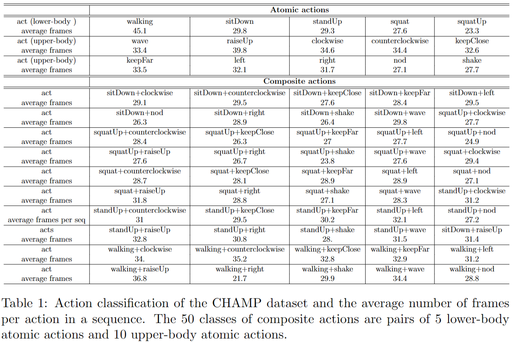
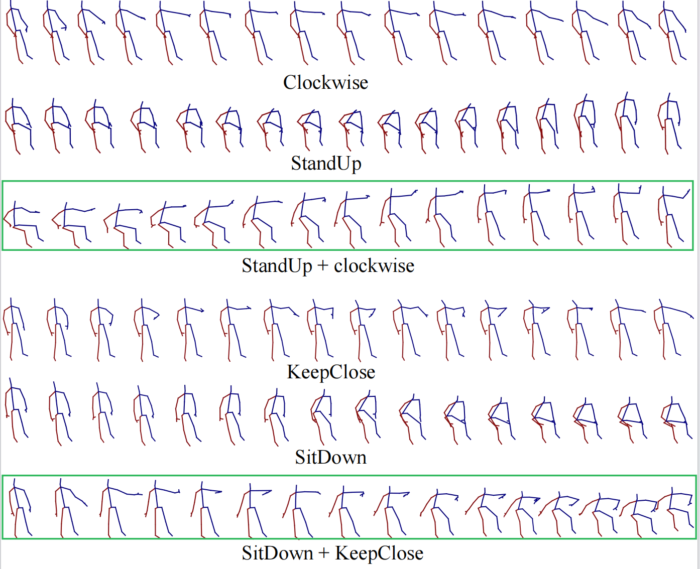
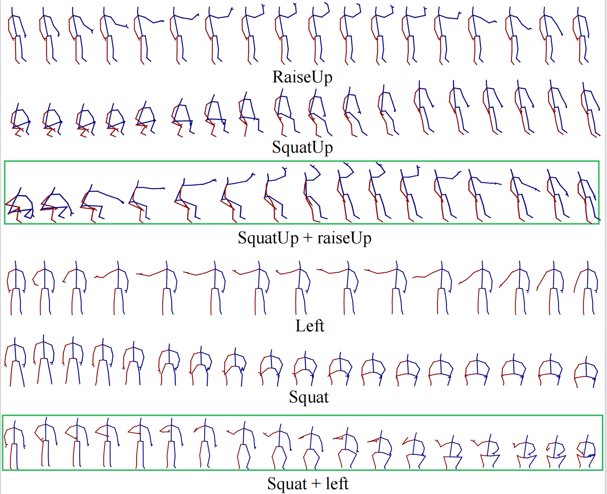
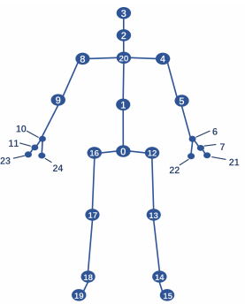

##Dynamic Compositional Graph Convolutional Network for Efficient Composite Human Motion Prediction


### Dependencies

* cuda 11.4
* Python 3.8
* [Pytorch](https://github.com/pytorch/pytorch) >1.11.0 

### the CHAMP dataset
CHAMP Dataset is a large-scale dataset for composite human motion prediction performed by 22 subjects. It is recorded 
 in a multimedia studio equipped with Microsoft Kinect V2 cameras, which is one of the most commonly used RGB-D devices. 
 Overall, our dataset contains 229134 visual frames for each viewpoint and image type.

We use Kinect V2 cameras to collect three primary data modalities: depth images, RGB frames, and 3D joint information. 
The two-dimensional depth values of depth images are measured in millimeters and have a resolution of 702 × 538 pixels at 
50 FPS, while RGB frames have the same resolution and frame rate as depth images. 

The joint information supplies automatically generated 3D locations of 25 major joints of a person using the algorithm 
provided by Microsoft, where skeleton generation is based on pixel location classification and pixel depth clustering 
with the use of a mean-shift algorithm with weighted Gaussian kernels. This approach enables us to 
obtain the skeleton nodes on the surface of the human body. A backward Z-value offset is required to achieve the correct 
3D skeleton node, and this offset value can be automatically learned.

We have a total of 66 pose classes, divided into two groups: atomic actions and composite actions. In detail, these comprise 
16 atomic actions, namely 10 upper-body actions (raise up, nod, wave, etc.), 5 lower-body actions (sit down, squat, walking,
etc.), and a still-state action.  The 50 composite actions are pairwise combinations of the atomic actions. Table 
below shows the action classification as well as the average number of frames per action sequence.


It is evident from the data set that the average number of frames for each action is approximately 30, which implies that
our actions have a broad range of motion completed within a short timeframe. Due to this characteristic, we focus on the 
short-term prediction of composite human motion in this study. Figure below shows 4 groups of examples of the 
CHAMP dataset. Each group of the examples visualizes an upper-body atomic action (Clockwise, RaiseUp, KeepClose, and Left),
a lower-body atomic action (StandUp, SquatUp, SitDown, and Squat), and their corresponding composite action (StandUp + 
Clockwise, SquatUp + RaiseUp, SitDown + KeepClose, and Squat + Left). As the data associated with walking requires further 
processing, we exclude them from our experiments.
 


A total of three cameras are utilized to capture each pose from three respective perspectives: front, left, and right. 
Specifically, three front views are captured simultaneously for each pose. Each subject captures the same pose five times 
to introduce variability.
For each sequence, we labeled the poses manually. The pose labels include the initial frame number and the terminal frame 
number, followed by the pose label itself. Table \ref{dataset comparison} shows a comparison between commonly-used datasets
for human motion prediction and our CHAMP dataset.


###Dataset structure: 
In this evaluation, we use 15 classes of atomic actions and 40 classes of composite actions.

Training data includes 15 classes of atomic actions performed by 21 subjects, where the labels are specified as: 
'still', 'sitDown', 'standUp', 'squat', 'squatUp',
'still_raiseUp', 'still_clockwise', 'still_counterclockwise', 'still_keepClose', 'still_keepFar',
'still_left', 'still_right', 'still_nod', 'still_shake', 'still_wave',

Validation data contains 40 classes of composite actions combined by 15 atomic actions, which are performed by subjects 2, 4, 6, 8, 10, 12, 14, 16, 18, 20, and 22.

Test data includes 40 classes of composite actions performed by subjects 1, 3, 5, 7, 9, 11, 13, 15, 17, 19, and 21 as well as 15 classes
of atomic actions performed by subject 2.


Configuration of 25 body joints in CHAMP dataset. The labels are: 
0-SpineBase 1-SpineMid 2- Neck 3-Head 4-ShoulderLeft 5-ElbowLeft 6-WristLeft 7-HandLeft 
8-ShoulderRight 9-ElbowRight 10-WristRight 11-HandRight 12-HipLeft 13-KneeLeft 14-AnkleLeft
15-FootLeft 16-HipRight 17-KneeRight 18-AnkleRight 19-FootRight 20-SpineShoulder 21-HandTipLeft
22-ThumbLeft 23-HandTipRight 24-ThumbRight




The video and our CHAMP dataset can be found at this link: https://drive.google.com/drive/folders/18TeCNsLtHBTqJ6J1ZwN0_oGUiHApBqZA?usp=sharing

Put the CHAMP dataset in ./datasets directory.

### Training
To train,
```bash
python main_MoE.py --kernel_size 10 --dct_n 20 --input_n 20 --output_n 10 --skip_rate 1 --batch_size 32 --test_batch_size 32 --in_features 72  --exp test
```

### Evaluation
To evaluate the pretrained model,
```bash
python main_eval_MoE.py --is_eval --kernel_size 10 --dct_n 20 --input_n 20 --output_n 10 --skip_rate 1 --batch_size 32 --test_batch_size 32 --in_features 72  --ckpt ./checkpoint/test/
```


### Acknowledgments
The overall code framework (dataloading, training, testing etc.) and predictor model code is adapted from [HisRepItSelf](https://github.com/wei-mao-2019/HisRepItself). 


